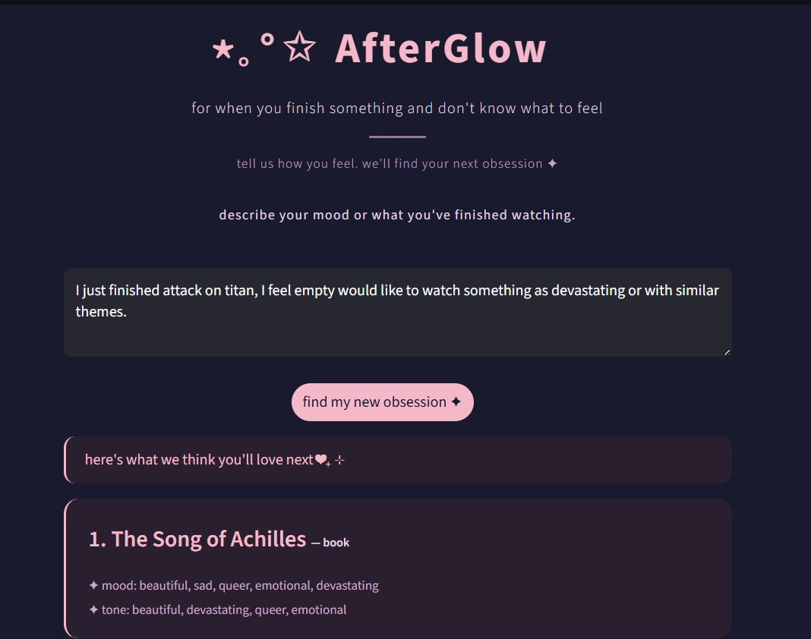

# ⋆｡°✩ AfterGlow

> *for when you finish something and don't know what to feel*

AfterGlow is a mood-based media recommendation system that suggests what to watch or read next — not based on genre or ratings, but based on **how you feel** after finishing something.



---

## ✦ What makes it different

Most recommendation systems ask *what you watched*. AfterGlow asks *how you felt*. 

Type something like:
- *"I just finished Attack on Titan and feel empty, want something equally devastating"*
- *"I want something funny and lighthearted to recover from a heavy watch"*
- *"I'm in the mood for something creepy with good plot twists"*

And AfterGlow finds your next obsession.

---

## ✦ Tech Stack

- **Python**
- **Streamlit** — UI
- **Scikit-learn** — TF-IDF Vectorization + Cosine Similarity
- **Pandas** — Dataset handling
- **NLP** — Custom stopwords, text preprocessing

---

## ✦ How it works

1. User describes their mood or what they just finished watching
2. Input is converted to a TF-IDF vector
3. Cosine similarity is calculated against a curated dataset of 51 anime, books, and web series
4. Top 5 most emotionally similar titles are returned

---

## ✦ Run it locally

```bash
git clone https://github.com/vedanti-asatkar/AfterGlow.git
cd AfterGlow
pip install -r requirements.txt
streamlit run app.py
```

---

## ✦ Dataset

A hand-curated dataset of 51 titles across anime, books, and web series — each tagged with mood descriptors, emotional tone, and after-watch suggestions. Built from personal watch history and emotional responses.

---

## ✦ Roadmap

- [x] v1 — TF-IDF + Cosine Similarity
- [ ] v2 — Sentence Transformers for semantic understanding
- [ ] Filter by type (anime only, books only)
- [ ] Deploy on Streamlit Cloud

---

## ✦ Author

**Vedanti Asatkar** — [GitHub](https://github.com/vedanti-asatkar)
